# Challenge ONE
## Foro Hub
**FORO-HUB** es una API REST desarrollada con **Spring Boot** que permite la creación y gestión de usuarios y tópicos. A través de autenticación con JWT, los usuarios pueden interactuar con el foro realizando operaciones como crear, actualizar y eliminar tópicos, así como consultar información específica.

## Funcionalidades principales

### Autenticación y Usuarios
- Crear nuevos usuarios mediante `POST /usuarios`
- Iniciar sesión con `POST /login` y recibir un token JWT
- Eliminar usuarios de manera lógica cambiando su estado `activo` a `false` (los usuarios pueden conservar sus tópicos en el foro)

### Gestión de Tópicos
- Crear nuevos tópicos autenticados (`POST /topicos`)
- Obtener:
    - Todos los tópicos
    - Tópicos por usuario
    - Tópicos por fecha de creación
    - Tópico específico por ID
- Actualizar campos (`PUT /topicos`): `titulo`, `mensaje` y `curso` (requiere ID en el cuerpo)
- Eliminar tópicos:
    - Lógicamente, cambiando el estado `status` a `false` (simula que fue resuelto) _(USER y ADMIN)_
    - Físicamente, eliminándolo completamente de la base de datos _(solo ADMIN)_

> **Notas**
> - Un `USER` puede realizar los siguientes metodos: **POST / GET / PUT** sobre tópicos propios y **eliminar por exclusión lógica**.
> - Un `ADMIN` puede **eliminar físicamente** tópicos desde el endpoint `/topico/eliminar/{id}`.
> - un `ADMIN` tambien puede **eliminar logicamente** usuarios, modificandoles el `status` a `false` desde el endpoint `/usuario/eliminar/{id}`.
## Autenticación con JWT

Una vez logueado, se obtiene un token JWT que debe incluirse en Postman u otras herramientas en el header:

``"Authorization": "Bearer <token>"``

Este token es necesario para acceder a los endpoints protegidos.

## Pruebas y desarrollo

Se utilizó **Postman** para probar todos los endpoints.

La estructura del proyecto se divide en carpetas organizadas por entidades (por ejemplo: `usuarios`, `topicos`) y se implementó el uso de **DTOs** para mejorar la gestión de datos entre capas.

##  Tecnologías usadas

- **Java 17**
- **Spring Boot**
- **Spring Security**
- **Spring Data JPA**
- **JWT (Java Web Token)**
- **MySQL**
- **Flyway**
- **Dotenv**
- **Lombok**

## Respuestas esperadas (referencial)

- `200 OK` / `204 No Content`: operación exitosa (consultas, actualizaciones, borrados lógicos/físicos)
- `201 Created`: creación de recursos
- `400 Bad Request`: datos inválidos
- `401 Unauthorized`: token ausente o inválido
- `403 Forbidden`: rol insuficiente para el endpoint (p. ej., `USER` intentando borrado físico)
- `404 Not Found`: recurso inexistente o ya eliminado físicamente

## Imagenes del proyecto:

## Usuario
| Creando un Usuario |
|--------------------|
| 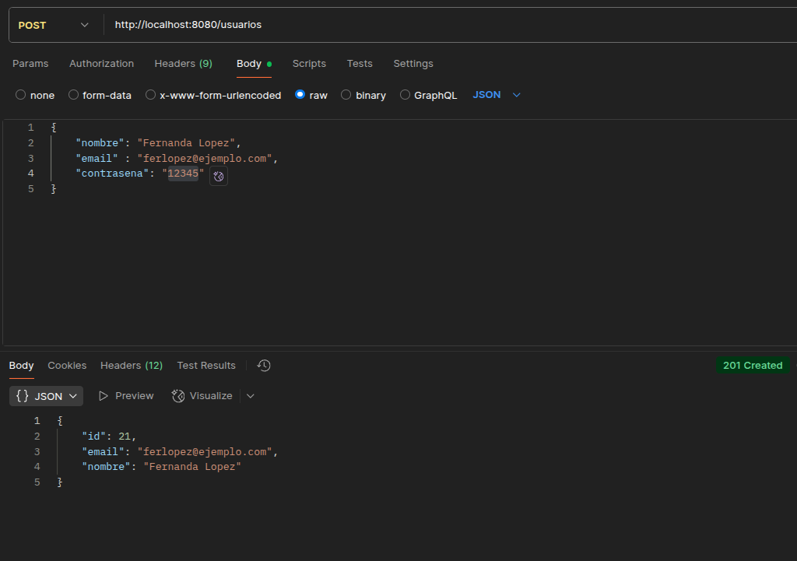]|

| Token devuelto al hacer Login                         |
|-------------------------------------------------------|
| 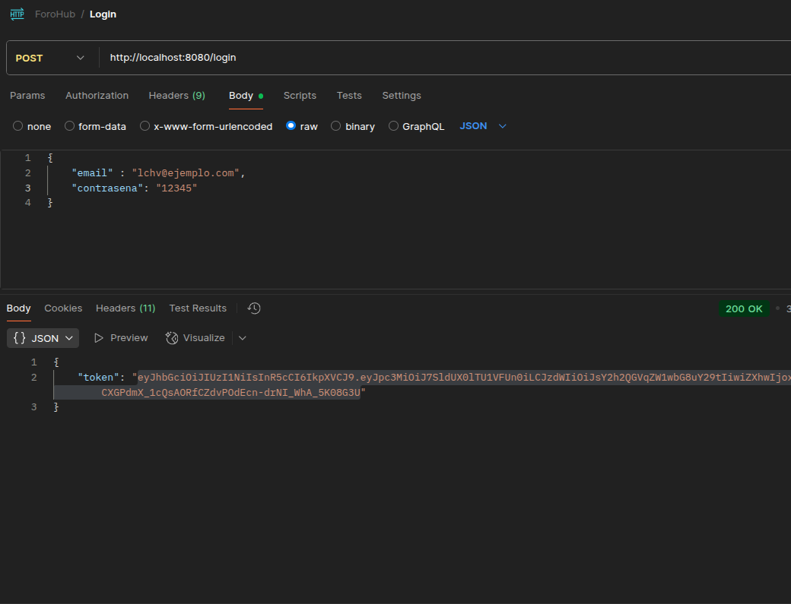                        |

| Eliminando Usuario por exclusion logica  |
|------------------------------------------|
|   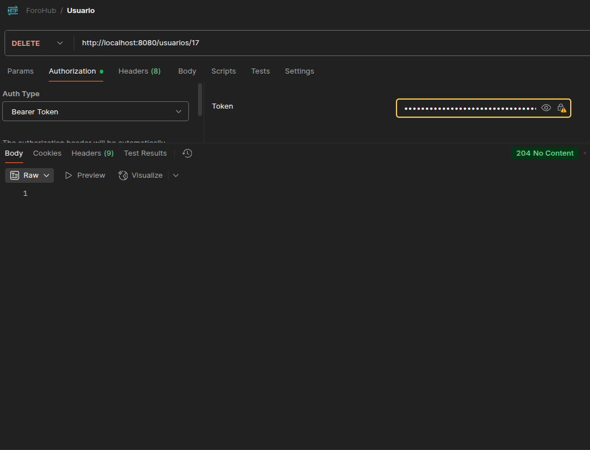        |

## Topicos

| Creando un Topico                                     |
|-------------------------------------------------------|
| 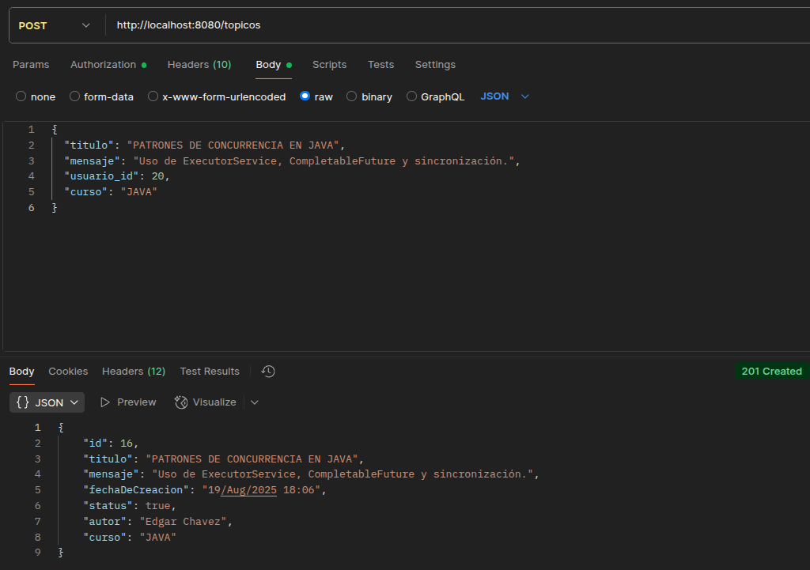 |

| Obteniendo un topico por id             |
|-----------------------------------------------|
| 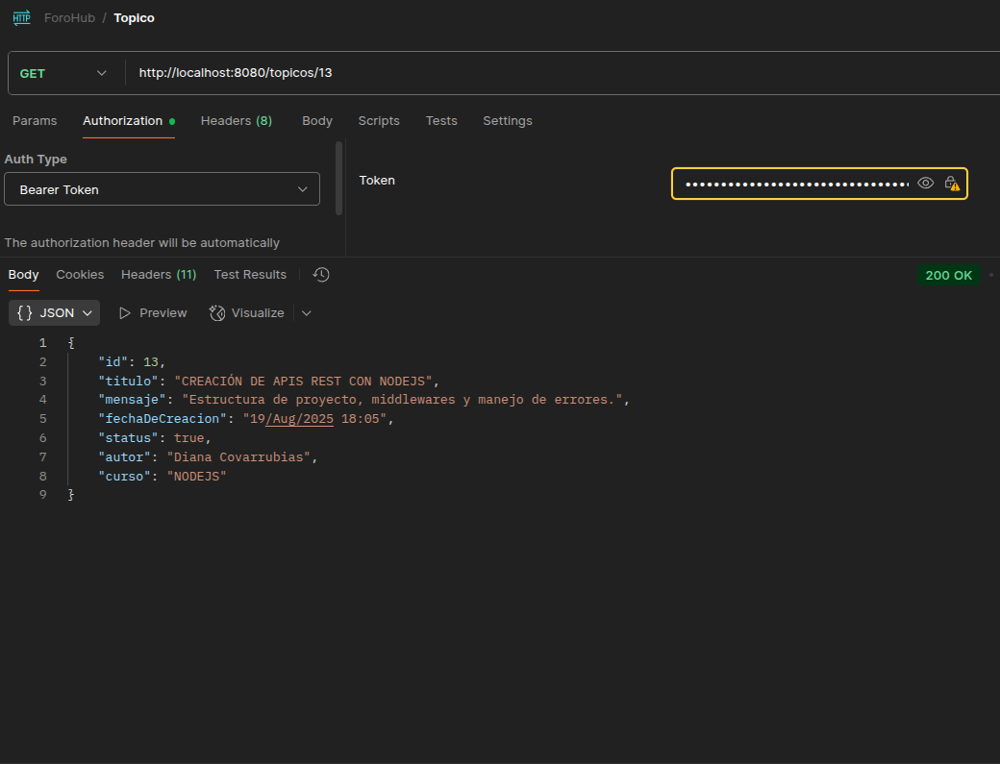 |

| Obteniendo todos los topicos                          |
|-------------------------------------------------------|
|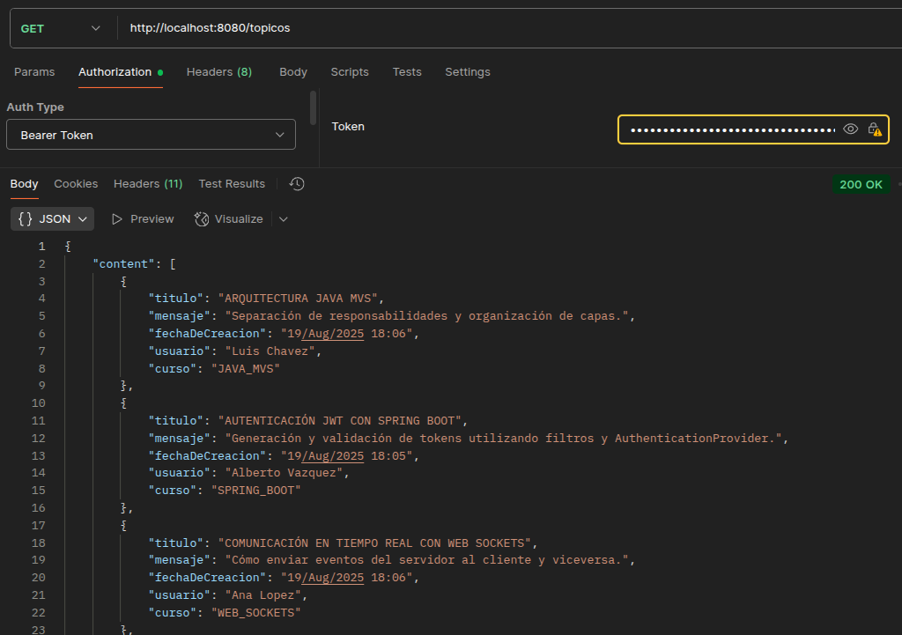 |

| Obteniendo topicos por usuario                        |
|-------------------------------------------------------|
| 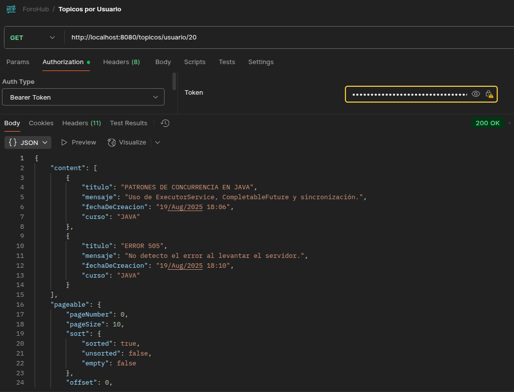 |

| Obteniendo topicos por fecha de elaboracion           |
|-------------------------------------------------------|
|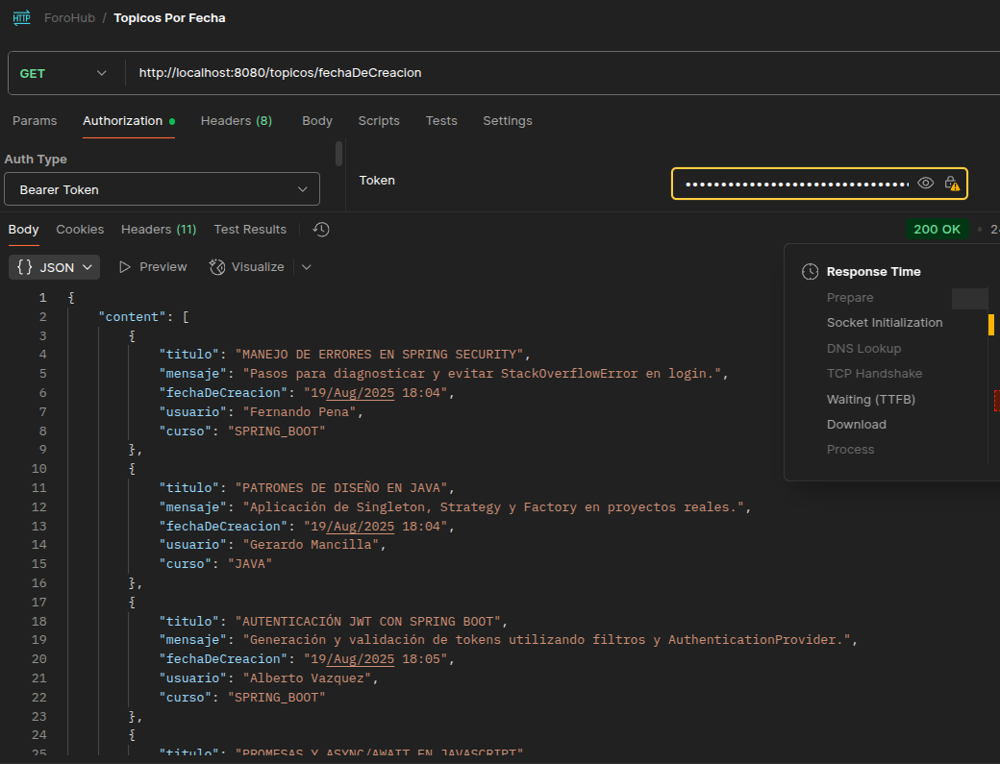  |

| Actualizando un Topico                                     |
|------------------------------------------------------------|
| 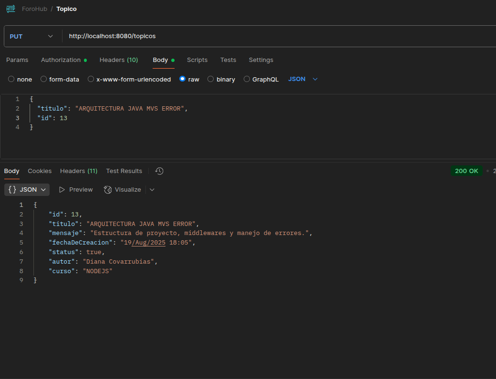 |

| Eliminando topico por exclusion logica         |
|------------------------------------------------|
| 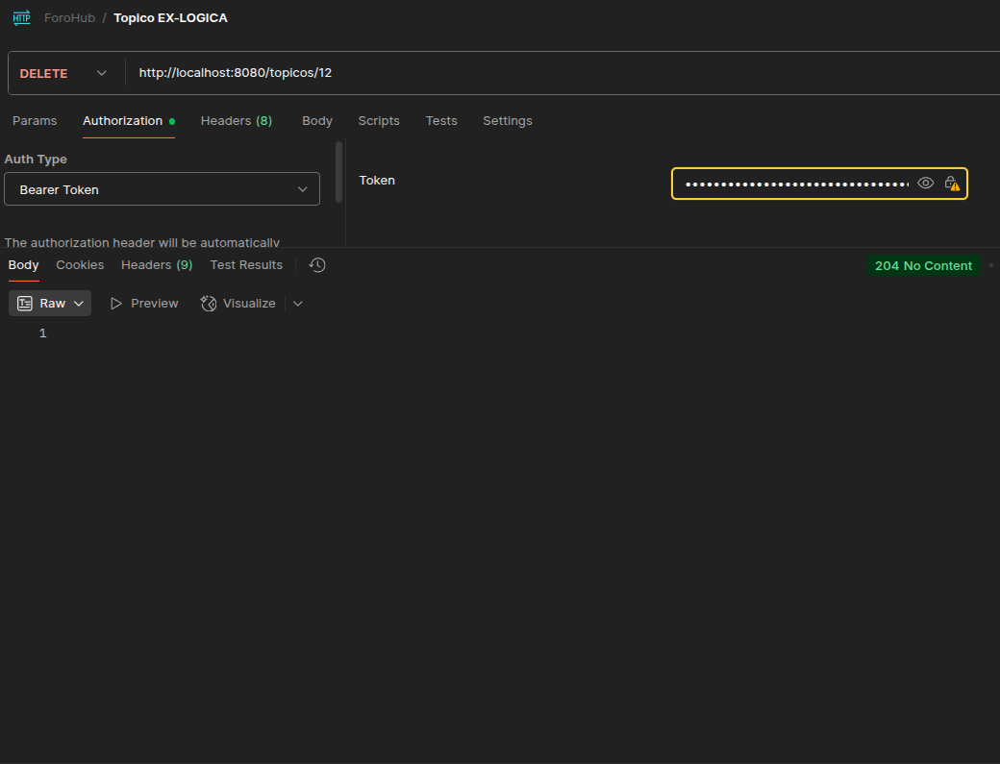 |

| Eliminando topico por exclusion fisica        |
|-----------------------------------------------|
| 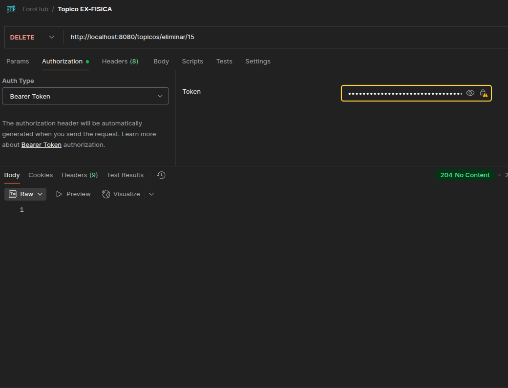 |

## Autora

Desarrollado por **Diana Campos** como parte del programa **Oracle Next Education (ONE)**.